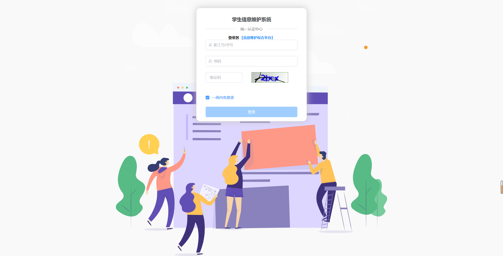
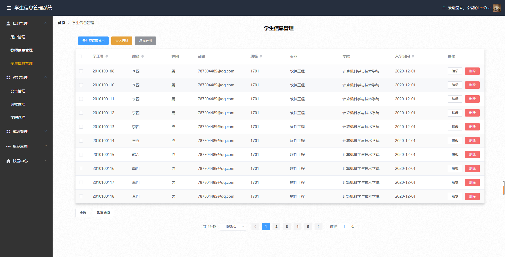
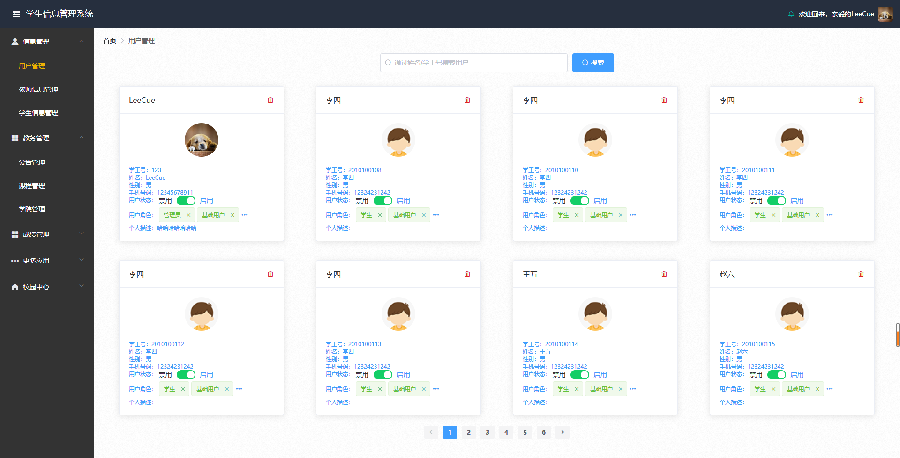
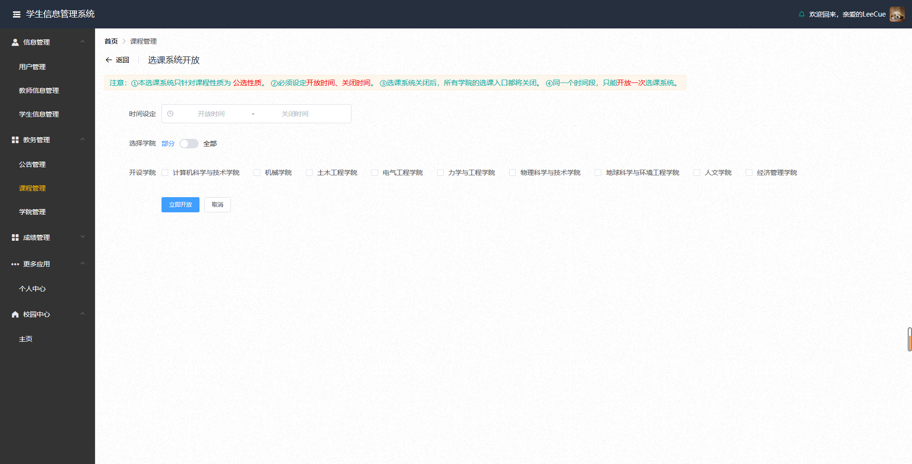
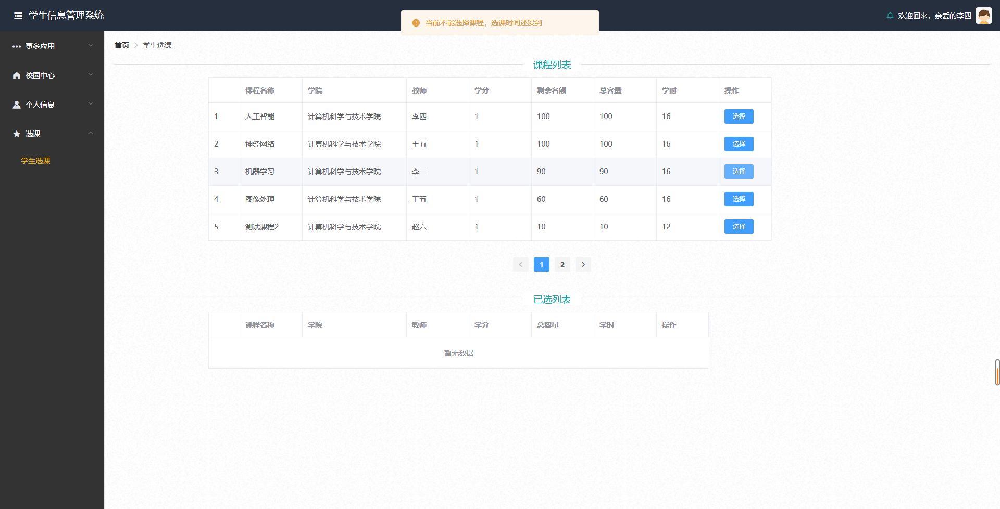

## 前言

&emsp;&emsp;线上体验地址：[点击访问](http://175.24.53.252:8000/)

&emsp;&emsp;后端项目地址：[点击访问](https://github.com/LeeCue/sims)

```
管理员内置账号：
	学工号：123 密码：123
	学工号：124 密码：123
	学工号：125 密码：123
	学工号：126 密码：123
学生用户：学工号，密码为该生身份证后六位。
```

&emsp;&emsp;关于前后端<font color='blue'>开发</font>中**跨域**问题，开发时采用后端解决方式，通过配置SpringSecurity中的cors项，允许跨域。

&emsp;&emsp;项目最终在<font color='blue'>部署</font>的时候，前后端采用独立部署，通过nginx来代理请求，从而解决了跨域问题。  

&emsp;&emsp;觉得此项目不错的小伙伴，不要忘记 **star**~。

## 项目简介

&emsp;&emsp;学生信息管理系统

- 基本功能包括

1. 学生信息管理，增删改查，以及文件备份，批量注册，前后端同时校验数据，讲异常数据响应给用户。
2. 用户信息管理，对于**角色控制**，用户状态的控制。
3. **课程信息管理**，课程相关管理。
4. 公告管理，发布最新的教务动态，或者教务系统公告。

&emsp;&emsp;采用**前后端分离**式开发，采用现阶段流行技术实现，例如：SpringBoot、Spring、SpringMVC、MyBatis。

- **核心功能**：

1. **定时开放与关闭选课系统**，定时开放采用redis中的键过期时间控制；系统关闭采用线程池中ScheduledThreadPoolExecutor来设置计划任务。
2. 用户**并发选课控制**，采用**异步处理**，并且使用缓存层Redis记录相关信息，同时采用aop编程思想，在第一次请求选课接口时，加载redis中lua脚本文件（只会加载一次）。

- - -

## 技术选型

#### 后端部分

- SpringBoot，作为整个管理容器
- SpringSecurity，一个强大的权限控制框架，与Spring的兼容性好一些相比于shiro。
- MyBatis，ORM框架
- PageHelper，分页插件
- Hibernate-Validator，验证框架
- ActiveMQ，消息队列
- Redis，分布式缓存
- Druid，数据库连接池
- FastJson，json序列化方式
- easyexcel，操作excel
- Lombok，简化pojo对象
- OSS，对象云存储，采用腾讯云对象存储

#### 前端部分

- node.js

- Vue
- ElementUI，前端组件库
- axios，异步请求，比ajax要轻量级一些。
- echarts，报表
- wangeditor，网页轻量级编辑器
- router，路由配置
- store，全局对象存储

---

## 运行截图

- **登录页面**：



- **首页**：


- **学生信息管理部分：**



- **用户管理部分：**



- **管理员开放选课系统：**



- **学生选课：**



---

## 前端项目结构

```
├─assets -- 静态资源
├─components -- 视图组件
├─plugins -- 插件
├─router -- 路由配置
├─store -- 存储
├─utils -- 工具类（包含api封装）
└─views -- 视图页面部分
    ├─admin -- 管理员视图
    ├─common -- 公共视图
    ├─student -- 学生视图
    └─teacher -- 教师视图
```

---

## 目前存在的问题

1. 功能没有完善，整个系统虽然是一个单体应用架构，但是逻辑结构很清晰，方便日后扩展功能点以及维护。

2. 用户登录，没有做人数上的并发控制。
3. 数据库没有进行合理的复制，一旦线上数据库宕机，需要手动的维护。

---

## 展望与总结

&emsp;&emsp;本次项目采用单体应用架构，学习**分布式理论**与**微服务**之后，有时间可以本项目的架构进行转型，如果有志同道合的朋友，可以一起开发。